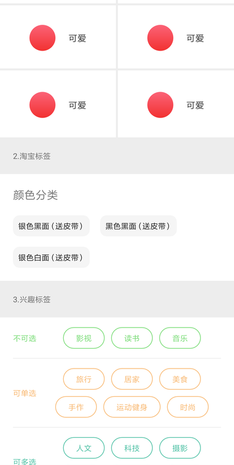

flowlayout
=======
[](https://jitpack.io/#guuguo/flowLayout)

Android 流式布局和网格布局共同体，支持单选、多选等，支持使用直接使用recycler的adapter避免重复写适配器
# 使用
```groovy
compile 'com.github.guuguo:flowLayout:$version' // jitpack version 
```
# 效果图




# 参考的库

https://github.com/LRH1993/AutoFlowLayout

# 使用方式

> xml 布局(可以使用xml直接内部加view也可以使用代码addview 或者FlowAdapter 或者RecyclerView.Adapter适配)

```xml
<top.guuguo.flowlayout.FlowLayout
    android:id="@+id/fl_no_check"
    android:layout_width="match_parent"
    android:layout_height="wrap_content"
    android:layout_marginLeft="10dp"
    app:checkType="none" 
    android:layout_marginRight="20dp"
    android:padding="15dp"
    app:divideSpace="10dp" 
    app:dividerColor="#FFFFFF"
    app:lineAlign="center" 
    app:columnNumbers="0" 
    />
```
> flowAdapter适配数据：
```java
FlowAdapter adapter = new FlowAdapter<String>() {
    @Override
   protected View onCreateView() {
       return MainActivity.this.getLayoutInflater().inflate(R.layout.item_tag, view, false)
   }
   @Override
   protected void onBindView(View view, String item, boolean isChecked) {
      //RoundTextView是一个第三方库     compile 'com.flyco.roundview:FlycoRoundView_Lib:1.1.4@aar'
       RoundTextView tv = view.findViewById(R.id.tv_content);
       tv.setText(item);
       tv.getDelegate().setStrokeColor(color);
       if (isChecked) { //如果设置了可以选择
           tv.setTextColor(Color.WHITE);
           tv.getDelegate().setBackgroundColor(color);
       } else {
           tv.setTextColor(color);
           tv.getDelegate().setBackgroundColor(Color.TRANSPARENT);
       }
   }
   @Override
   protected void isMaxChecked(int limitedMaxNum) {
       super.isMaxChecked(limitedMaxNum);
       Toast.makeText(MainActivity.this, "最多只能选择" + limitedMaxNum + "个", Toast.LENGTH_SHORT
   }
;
dapter.setNewData(toList(strS));
flowLayout.setAdapter(adapter);
```
> adapter获取选中的内容：
```java
adapter.getCheckedMap() //返回 hashMap 键是position 值是传入的泛型item
```
> 设置限制选择数量：
```java
 adapter.setCheckLimit(3); //-1是不能选择,0是不限制多选,1是单选
```
# 自定义参数 attr
===

```xml 
 <!--子view间隔-->
<attr name="divideSpace" format="dimension" />
<!--如果是0 则为流式布局，>0 则为网格布局-->
<attr name="columnNumbers" format="integer" />
<!--在子view间隔上绘制颜色-->
<attr name="dividerColor" format="color" />
<!--流式布局每行的对齐方式-->
<attr name="lineAlign" format="enum">
    <enum name="left" value="0" />
    <enum name="center" value="1" />
    <enum name="right" value="2" />
</attr>
<!--默认none 无法选择，single单选，multi多选(需要使用FlowAdapter适配数据才能选择)-->
<attr name="checkType" format="enum"> 
    <enum name="none" value="-1" />
    <enum name="multi" value="0" />
    <enum name="single" value="1" />
</attr>
```


